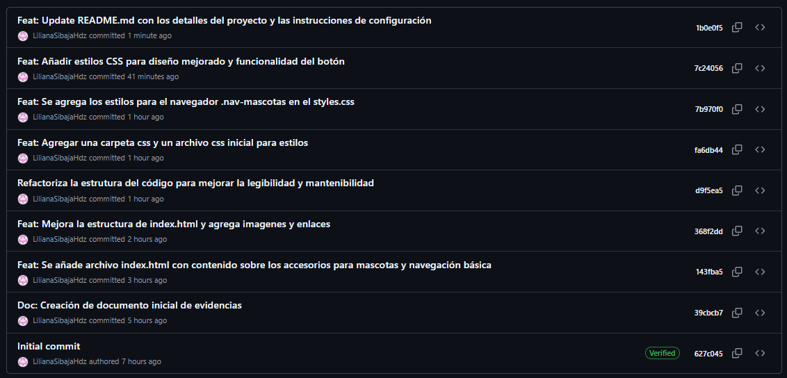

# Evidencias 🖥️👩🏻‍💻

En este apartado se encuentran las evidencias correspondientes al
desarrollo y despliegue del proyecto.

------------------------------------------------------------------------

## 📁 Ubicación de las evidencias

Todas las imágenes se encuentran dentro de la carpeta:

    /evidencias

> Asegúrate de mantener nombres claros para cada archivo, por ejemplo:
>
> - `historial-commits.png`
> - `github-pages.png`

------------------------------------------------------------------------
## 📜 Historial de Commits

------------------------------------------------------------------------

## 🌐 Vista de GitHub Pages

------------------------------------------------------------------------

## 🌐 GitHub Pages

Puedes visualizar la página desplegada en el siguiente enlace:

🔗 (https://lilianasibajahdz.github.io/proyecto-final-Accesorios-para-mascotas/)

------------------------------------------------------------------------

## 📝 Aprendizajes

### 1️⃣ ¿Qué fue lo más fácil y lo más retador?

**Respuesta:**\
*Aprender a que no debo poner un repo dentro de otro repo*

------------------------------------------------------------------------

### 2️⃣ ¿Qué etiquetas semánticas usaste y por qué?

En el desarrollo del proyecto utilicé etiquetas semánticas como:

-   `<header>`
-   `<nav>`
-   `<main>`
-   `<section>`
-   `<article>`
-   `<footer>`

Estas etiquetas permiten estructurar correctamente el contenido, mejorar
la accesibilidad y optimizar el SEO del sitio web.

(Complementa con tu explicación personal si es necesario)

------------------------------------------------------------------------

### 3️⃣ ¿Cómo organizaste tus commits?

Los commits fueron organizados de manera progresiva, separando cada
avance significativo del proyecto, por ejemplo:

-   Estructura inicial HTML
-   Agregado de estilos CSS
-   Ajustes de diseño
-   Corrección de errores
-   Preparación para despliegue

Esto permitió mantener un historial claro y ordenado del desarrollo.

------------------------------------------------------------------------

### 4️⃣ ¿Qué mejorarías en la siguiente iteración?

En una siguiente versión del proyecto me gustaría:

-   Mejorar la responsividad para dispositivos
-   Optimizar estilos y estructura del CSS
-   Añadir más interactividad con JavaScript

------------------------------------------------------------------------

✨ Este documento forma parte de las evidencias del proyecto final.
